# OmniAgent

<p align="center">
  
</p>

<p align="center">
  <strong>21 tests passing</strong> · <strong>6 contracts verified</strong> · <strong>Deployed on Base Sepolia + Arbitrum Sepolia</strong>
</p>

<p align="center">
  <a href="https://testnet.layerzeroscan.com/tx/0x89f70943d58990a2925637d23e9dfbe0ee4e97ddd7d72572d30b7ff726ba63e5">LayerZero Scan</a> ·
  <a href="https://sepolia.basescan.org/tx/0x89f70943d58990a2925637d23e9dfbe0ee4e97ddd7d72572d30b7ff726ba63e5">Basescan</a> ·
  <a href="docs/architecture.html">Interactive Architecture</a> ·
  <a href="docs/how-it-works.html">Animated Flow</a>
</p>

---

Agents registered on Base can cryptographically prove their identity, reputation, and validation status on Arbitrum, Optimism, and any LayerZero-supported chain.

## Why

AI agents increasingly operate across multiple chains. Today there's no way for an agent on Arbitrum to verify that another agent is who they claim to be — because the identity registry lives on Base. This project solves that.

## How It Works

The system is a two-step process: **bridge once, verify forever**.

### Step 1: Bridge (one-time, on Base)

The agent requests its identity and reputation to be bridged to a destination chain. Only the agent's owner (the wallet holding the ERC-721 identity NFT) can initiate this.

```
Agent calls AgentBridge.bridgeIdentity(agentId, arbitrumEid)
  → Contract verifies caller owns the agent NFT (ownerOf check)
  → Reads identity URI + reputation score directly from on-chain registries
  → Encodes payload and sends via LayerZero
  → DVNs (Decentralized Verifier Networks) independently verify the message
  → ~30 seconds later: identity is cached on Arbitrum
```

### Step 2: Verify (anytime after, on destination chain)

Once bridged, **any contract** on the destination chain can verify the agent — without the agent doing anything else.

```
Any contract calls AgentBridgeReceiver.verifyAgent(agentAddress)
  → returns (true, 85)  // exists=true, reputationAvg=85
```

The `ReputationGatedVault` is one example consumer, but any DeFi protocol, marketplace, or agent-to-agent service can call `verifyAgent()` or `isReputable()` to gate access.

### Data Freshness

Bridged data is a **snapshot** taken at the time of bridging. Every cached identity includes a `bridgedAt` timestamp so consuming contracts can decide how fresh they need the data to be. If an agent's reputation changes on Base, they bridge again to refresh the cache on the destination chain.

A high-stakes vault might require data bridged within the last hour. A simple access gate might accept data from days ago. **The consumer decides.**

### Trust Chain

```
Can I trust this identity on Arbitrum?
│
├─ Was it sent by the real AgentBridge on Base?
│  └─ YES: peer validation ensures only the registered contract is accepted
│
├─ Was the message actually sent on Base, not forged?
│  └─ YES: LayerZero DVNs independently verified the Base blockchain state
│
├─ Was the data accurate at time of bridging?
│  └─ YES: AgentBridge reads directly from on-chain registries, no user input
│
├─ Could someone bridge a fake identity?
│  └─ NO: ownerOf(agentId) == msg.sender — only the NFT owner can bridge
│
└─ Could someone tamper with the message in transit?
   └─ NO: LayerZero uses packet hashing + nonce ordering + DVN consensus
```

## Architecture

```
BASE (Source of Truth)                    ARBITRUM / OPTIMISM (Destinations)
┌─────────────────────┐                  ┌──────────────────────────────┐
│ ERC-8004 Registries  │                  │  AgentBridgeReceiver (OApp)  │
│ ┌─────────────────┐ │                  │                              │
│ │ Identity Registry│ │   LayerZero V2   │  Cached Identities:          │
│ │ (ERC-721 NFTs)  │◄├─────────────────►│  • agentId, owner, URI       │
│ └─────────────────┘ │   cross-chain    │  • reputation avg/count      │
│ ┌─────────────────┐ │    messaging     │  • source chain + timestamp  │
│ │ Reputation       │ │                  │                              │
│ │ Registry         │ │                  │  Public Verification API:    │
│ └─────────────────┘ │                  │  • verifyAgent(addr)         │
│                     │                  │  • isReputable(addr, min)    │
│ AgentBridge (OApp)  │                  │                              │
│ • reads registries  │                  ├──────────────────────────────┤
│ • encodes payload   │                  │  ReputationGatedVault (Demo) │
│ • sends via LZ      │                  │  • deposit() — gated by     │
└─────────────────────┘                  │    verified identity + rep   │
                                         └──────────────────────────────┘
```

## Autonomous Bridge Agent

The agent implements the full **discover → analyze → decide → execute → verify** loop:

```
┌─────────┐     ┌─────────┐     ┌────────┐     ┌─────────┐     ┌────────┐
│ DISCOVER │────►│ ANALYZE │────►│ DECIDE │────►│ EXECUTE │────►│ VERIFY │
│          │     │          │     │         │     │          │     │         │
│ Monitor  │     │ Read rep │     │ Score   │     │ Bridge   │     │ Confirm │
│ registry │     │ + identity│    │ >= 50?  │     │ to all   │     │ arrival │
│ for new  │     │ on-chain │     │ Has     │     │ dest     │     │ on dest │
│ agents   │     │          │     │ reviews?│     │ chains   │     │ chains  │
└─────────┘     └─────────┘     └────────┘     └─────────┘     └────────┘
```

```bash
# Run in demo mode (deploys local mocks, registers 3 agents, shows full decision loop)
npx hardhat run agent/bridge-agent.ts

# Run against testnets
IDENTITY_REG=0x... REPUTATION_REG=0x... BRIDGE_ADDR=0x... \
DEST_EIDS=40231,40232 RECEIVER_ADDRS=0x...,0x... MIN_REPUTATION=50 \
  npx hardhat run agent/bridge-agent.ts --network base-sepolia
```

Demo output:
```
🔍 DISCOVER [Agent #0] Found agent
📊 ANALYZE  [Agent #0] Reputation: avg=87, count=2
🧠 DECIDE   [Agent #0] BRIDGE: Reputation 87 with 2 reviews — high confidence
🚀 EXECUTE  [Agent #0] Bridging to 2 chain(s): [40231, 40232]
✅ VERIFY   [Agent #0] Bridge complete

🔍 DISCOVER [Agent #1] Found agent
📊 ANALYZE  [Agent #1] Reputation: avg=20, count=1
🧠 DECIDE   [Agent #1] SKIP: Reputation 20 below threshold 50

🔍 DISCOVER [Agent #2] Found agent
📊 ANALYZE  [Agent #2] Reputation: avg=0, count=0
🧠 DECIDE   [Agent #2] SKIP: No reputation feedback yet — waiting for reviews

📋 SUMMARY: 3 agents processed, 1 bridged
```

The agent also produces a structured `conversationLog` (JSON) for hackathon submission.

## Contracts

| Contract | Chain | Purpose |
|----------|-------|---------|
| `AgentBridge.sol` | Base | Reads all 3 ERC-8004 registries, bridges identity cross-chain via `_lzSend`. Supports `bridgeToAll()` for multi-chain batch bridging. |
| `AgentBridgeReceiver.sol` | Arb/OP/etc | Caches bridged identities, exposes `verifyAgent` / `isReputableFresh` / `isVerifiedAgent` / `verifyAgentFull` API |
| `ReputationGatedVault.sol` | Arb/OP/etc | Demo: ETH vault that only accepts deposits from verified, reputable agents |
| `MockIdentityRegistry.sol` | Testnet | ERC-721 based identity registry (ERC-8004) |
| `MockReputationRegistry.sol` | Testnet | Feedback-based reputation (ERC-8004) |
| `MockValidationRegistry.sol` | Testnet | Request/response validation with scores (ERC-8004) |

## Deployed Contracts (Testnet)

**Base Sepolia:**

| Contract | Address |
|----------|---------|
| MockIdentityRegistry | [`0x51a07E8f24c8704e5e76ed0A76Cc68096536edbb`](https://sepolia.basescan.org/address/0x51a07E8f24c8704e5e76ed0A76Cc68096536edbb) |
| MockReputationRegistry | [`0x070425B1d977e4871fc7A3841E6382Db8560a360`](https://sepolia.basescan.org/address/0x070425B1d977e4871fc7A3841E6382Db8560a360) |
| MockValidationRegistry | [`0x4B7A3D7D0D2Fce8A25C5fAEd3204aa471f8fE06b`](https://sepolia.basescan.org/address/0x4B7A3D7D0D2Fce8A25C5fAEd3204aa471f8fE06b) |
| AgentBridge | [`0x83A543C32Bda488b51C29b31ccA490cD6F7d5CdD`](https://sepolia.basescan.org/address/0x83A543C32Bda488b51C29b31ccA490cD6F7d5CdD) |

**Arbitrum Sepolia:**

| Contract | Address |
|----------|---------|
| AgentBridgeReceiver | [`0xEC50f64bAC775bF6b614D1E51E8B8daf7dcE41e2`](https://sepolia.arbiscan.io/address/0xEC50f64bAC775bF6b614D1E51E8B8daf7dcE41e2) |
| ReputationGatedVault | [`0xa69EEb57203C2526772603c9B3C1c8FFF6fA4BDE`](https://sepolia.arbiscan.io/address/0xa69EEb57203C2526772603c9B3C1c8FFF6fA4BDE) |

**Verified Cross-Chain Bridge Transaction:**

- [LayerZero Scan](https://testnet.layerzeroscan.com/tx/0x89f70943d58990a2925637d23e9dfbe0ee4e97ddd7d72572d30b7ff726ba63e5) — Base Sepolia → Arbitrum Sepolia
- [Basescan](https://sepolia.basescan.org/tx/0x89f70943d58990a2925637d23e9dfbe0ee4e97ddd7d72572d30b7ff726ba63e5) — Source transaction

## Quick Start

```bash
# Install
npm install --legacy-peer-deps

# Compile
npx hardhat compile

# Test (21 tests)
npx hardhat test

# Run autonomous agent demo
npx hardhat run agent/bridge-agent.ts

# Execute real testnet bridge
npx hardhat run scripts/testnet-bridge.ts --network base-sepolia
```

## LayerZero Endpoint IDs

| Network | EID |
|---------|-----|
| Base Mainnet | 30184 |
| Base Sepolia | 40245 |
| Arbitrum Sepolia | 40231 |
| Optimism Sepolia | 40232 |

## Hackathon

Built for **The Synthesis** hackathon. Target tracks:
- **Agents With Receipts — ERC-8004** (Protocol Labs)
- **Let the Agent Cook** (Protocol Labs)
- **Synthesis Open Track** (Community)

## License

MIT
